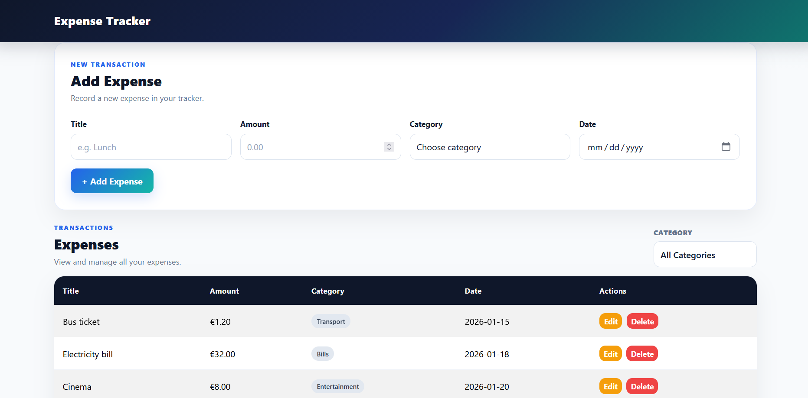
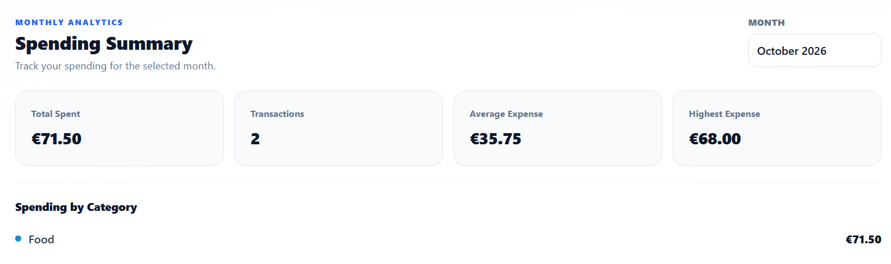
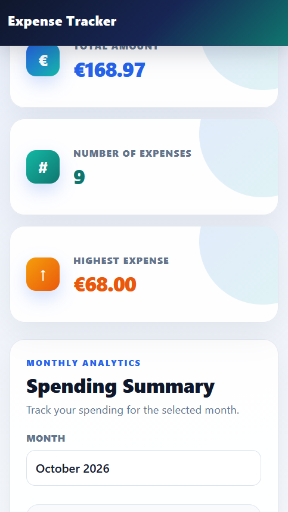

# Expense Tracker

Expense Tracker is a full-stack web application for managing personal expenses. Users can add, edit, delete, and filter expenses, while the application stores the data in PostgreSQL and provides summary information and monthly spending statistics.

## How to run

Assume Node.js, PostgreSQL, and VS Code are already installed.

Backend

1.Open PostgreSQL and create a database named expense_tracker.

2.Open the project in VS Code.

3.Open the terminal and go to the backend folder:

cd backend

4.Open schema.sql from the backend folder in pgAdmin or PostgreSQL and execute it on the expense_tracker database.

5.Create a file named .env inside the backend folder.

6.Add the following configuration:

DB_HOST=localhost
DB_PORT=5432
DB_USER=postgres
DB_PASSWORD=mmmmoooo
DB_NAME=expense_tracker

Install the backend dependencies:

npm install

Start the backend server:

node server.js

The backend server will run at:

http://localhost:3000

Frontend

Open the frontend folder in VS Code.

Open frontend/index.html using VS Code Live Server.

The Expense Tracker application will open in the browser.

Make sure the backend server is running before using the application.

## Features

- [1] Add an expense with validation
- [2] Edit an expense
- [3] Delete an expense
- [4] Filter expenses by category
- [5] Summary cards for total amount, number of expenses, and highest expense
- [6] Store expenses in PostgreSQL
- [7] Monthly spending summary
- [8] Responsive design

## Screenshots

### Desktop

### Monthly Spending Summary

### Mobile

## What was the hardest part?

The hardest part was connecting the frontend with the backend and PostgreSQL database while keeping the displayed data updated after adding, editing, and deleting expenses.
Another challenging part was implementing the Monthly Spending Summary. The solution was to use the existing expense data and calculate the monthly statistics from the amount, date, and category fields without changing the database structure.
